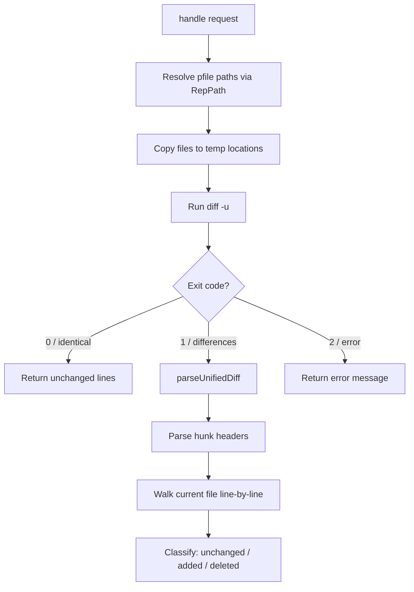
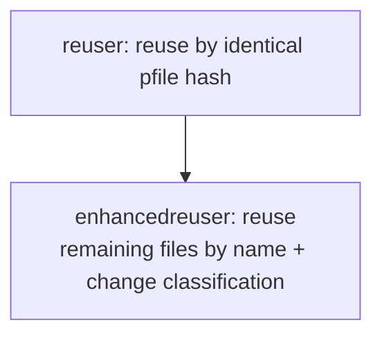
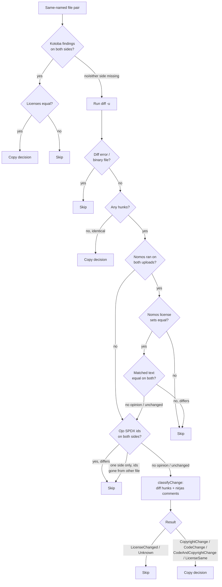

## Enhanced Reuse Agent for Intelligent License Reuse

**Contributor:** [Saksham Mishra](https://github.com/sakshammishra112)  
**Organization:** [FOSSology](https://www.fossology.org/)  
**Program:** Google Summer of Code 2026  
**Email:** [sakshammishra112@gmail.com](mailto:sakshammishra112@gmail.com)

---

## Project Details

My GSoC 2026 work focused on enhancing FOSSology's Reuse Agent to intelligently select and apply license reuse decisions, reducing manual effort in the compliance workflow.

The first major part of the project introduced an **Auto Select** mechanism for reuse. Instead of requiring users to manually identify and select a previously cleared upload to reuse from, the system now automatically discovers the best matching upload by combining package-name matching with PFile fingerprint overlap analysis and clearing-decision quality checks. This operates through a three-level pipeline: eligibility filtering by user and group access, ranking by version proximity and date, and a final clearing-decision quality gate.

The second major part added a **Reuse Diff View** that lets users compare a file against the file it was reused from, showing a line-by-line unified diff alongside license and metadata changes. This provides transparency into what changed between versions and helps users understand how reuse decisions map across file modifications.

The third major part was the **Enhanced Reuser Agent** — a new C++ agent that extends FOSSology's standard hash-based reuser to handle files that are *similar but not identical*. When files share the same name but differ in content (e.g. a copyright year bump, a reformatted comment, or an unrelated code change), the enhanced reuser classifies the type of change and copies clearing decisions when the license status is preserved. It uses a multi-gate decision pipeline that consults Kotoba, Nomos, Ojo, and a diff/comment classifier to make conservative, well-reasoned reuse decisions.

Together, these contributions make the reuse workflow faster, more transparent, and more capable of handling real-world version-to-version file evolution.

---

## Work Completed

## Detailed Breakdown

### 1. Reuse Diff View

**Pull Request:** [fossology/fossology#3717](https://github.com/fossology/fossology/pull/3717)

This PR adds a "Reuse Diff View" that lets users compare a file against the file it was reused from, showing a line-by-line diff alongside license and metadata changes. Part of [#3631](https://github.com/fossology/fossology/issues/3631).

Before this work, users had no way to see what actually changed between a file and its reused counterpart. The diff view provides this transparency directly in the reuser UI.

---

### Technical Implementation

The Reuse Diff View consists of a PHP plugin and a Twig template that work together to produce a two-panel comparison view.

#### Backend

The `ReuseFileDiffViewPlugin` handles request parsing, file resolution, diff generation, and license comparison:

- **Entry point:** `handle($request)` parses upload, item, currentPfile, reusedPfile, and reuse request parameters.
- **Access control:** Checks `Auth::getGroupId()` and `isAccessible()`, returning a 403 when the user lacks permission.
- **File metadata:** `getPfileData()` lookups for both the current and reused pfiles (size, SHA1, mimetype).
- **Diff generation:** `generateDiff()` resolves both file paths via `RepPath()`, copies them to temp locations, runs `diff -u`, and captures the structured output.
- **Unified diff parsing:** `parseUnifiedDiff()` converts raw diff output into a structured array of unchanged/added/deleted lines with line numbers by parsing hunk headers and walking the current file's lines.
- **License comparison:** Merges and sorts (via `ksort()`) the current and reused license lists by `rf_shortname`, flagging licenses as added, removed, or present in both.
- **Navigation:** `getUploadtreeIdFromPfile()` and `Dir2Browse()` integration builds the breadcrumb trail.

---

### Diff Generation Pipeline



---

### License Status Priority

When comparing licenses between the current and reused files, each license is classified into one of five statuses:

| Priority | Condition | Status |
| --- | --- | --- |
| 1 | `removed = true` on reuse | Removed from Reuse |
| 2 | `removed = true` on current | Removed from Current |
| 3 | Both scanners found it | Common |
| 4 | In reuse effective, not in current scanner | Added to Reuse |
| 5 | User-added on current, not in reuse | Added to Current |

---

### Template Layout

The `reusediffview.html.twig` template renders a two-panel layout:

- **Left panel:** Line-by-line diff view with a legend (added/deleted/unchanged).
- **Right panel:** Diff statistics (counts and percentages), file details (size, SHA1, MIME type for both files), and a license comparison table.

---

### Why the Total and Unpack Counts Differ

The Unpack count includes both files and directories, while the Total Files count includes only non-directory files. This is because `getAllNonArtifactDescendants()` filters out directory entries using `AND ut.ufile_mode & (3<<28) = 0`.

---

### 2. Auto Select for Reuse

**Pull Request:** [fossology/fossology#3676](https://github.com/fossology/fossology/pull/3676)

This PR introduces an **Auto Select** for Reuse option in the Reuser Configuration that automatically discovers and selects the most suitable previously cleared upload for reuse. The feature searches for reusable uploads using package name matching and PFile overlap analysis before job scheduling, then executes the existing reuse workflow without requiring manual upload selection.

Part of [#3631](https://github.com/fossology/fossology/issues/3631).

---

### Selection Algorithm

The algorithm operates in three levels:

#### First Level — Eligibility

From all available uploads, consider only uploads that meet both of the following criteria:

- Uploaded by the same user.
- The upload belongs to a group to which the user has access.

#### Second Level — Ranking

**If the user has selected a specific upload status**, select one best matching upload based on:

1. Date.
2. Nearest matching version, with version taking precedence over date.

For example, if the requested version is `upload-1.0` and both `upload-1.0` and `upload-0.9` are available, `upload-1.0` should be preferred even if `upload-0.9` was uploaded more recently.

**If the user has NOT selected a specific upload status**, select the 4 best matching uploads using the same ranking principle (nearest version, then date). For example, if `upload-1.0` is available, the sort order would be `upload-1.0`, `upload-0.9`, `upload-0.8`, `upload-0.7`.

#### Third Level — Clearing Decisions

For the 3–4 best matching uploads identified above:

1. Check the `clearing_decisions` for the best matching upload.
2. If clearing decisions are available and all files are cleared, select this upload.
3. If not, check the next best matching upload.
4. If none is fully cleared, select the upload with the highest percentage of cleared files (provided clearing decisions are available).
5. If no clearing decisions are available for any of the selected uploads, fall back to the single best match based on version and date.

The tool does **not** select all available uploads. It narrows candidates by user/group access, ranks them by version/date, and uses clearing decisions as the final tiebreaker.

---

### Primary Search: Package Name Matching

| Step | Action | Example |
| --- | --- | --- |
| 1 | Extract base package name | `zlib-1.2.10` → `zlib` |
| 2 | Search by match type (exact → case-insensitive → prefix → ILIKE) | `zlib` → `zlib` |
| 3 | Rank by uploader relationship (same user → same group → any accessible) | Upload A wins |
| 4 | Resolve ties by most recently cleared | Upload B wins |

### Secondary Search: PFile Overlap

Only executed if the primary search finds no suitable upload. Compares actual upload contents via PFile fingerprints:

| Candidate | Matching PFiles | Overlap Score |
| --- | --- | --- |
| Upload A | `a.c`, `b.c`, `c.c` | 3 |
| Upload B | `a.c`, `b.c`, `c.c`, `d.c` | 4 |
| Upload C | `a.c` | 1 |

The candidate with the highest overlap score is selected. Ties are resolved by most recently cleared upload.

---

### Structured Upload Data

The upload selection data was restructured from a flat map to a structured array:

**Before:** Flat map structure

```json
{"42" : "nltk-3.7.tar.gz from 2026-08-19 09:12:28 (closed)"}
```

**After:** Structured array of objects via `buildStructuredUploads()` (`reuser-plugin.php:258`)

```json
{
    "uploadId": 42,
    "groupId": 3,
    "filename": "nltk-3.7.tar.gz",
    "timestamp": "2026-08-19 09:12:28",
    "statusId": 3,
    "clearedAt": null,
    "display": "nltk-3.7.tar.gz from 2026-08-19 09:12:28 (closed)"
}
```

---

### 3. Enhanced Reuser Agent

**Pull Request:** [fossology/fossology#3778](https://github.com/fossology/fossology/pull/3778)

`enhancedreuser` extends FOSSology's standard "reuse" feature. The stock `reuser` agent only copies a clearing decision from a previously cleared upload to a new upload when the reused file's content is **byte-identical** (same pfile hash). `enhancedreuser` additionally copies decisions for files that are *similar but not identical* — e.g. a copyright year bump, a reformatted comment, or an unrelated code change elsewhere in the file — by matching files by name and classifying what actually changed between the two versions.

It runs as a dependency of `reuser` and is scheduled automatically when a user selects "Enhanced Reuse" in the reuser configuration; it has no standalone UI.

---

### Where it Fits



`enhancedreuser` only looks at pfiles that:

1. Have a clearing decision in the **reused** upload, and
2. Do **not already** have a clearing decision at a matching file path/name in the **target** upload (i.e. whatever the standard hash-based reuser already handled is skipped).

---

### Decision Pipeline

For each candidate pfile pair (reused file ↔ same-named target file), `enhancedreuser` runs a sequence of gates, in order, and stops at the first one that reaches a verdict. Later gates only run if earlier ones have no opinion (missing/insufficient scanner data on one or both sides).



### Gate 1: Kotoba License Oracle

If the `kotoba` agent ran successfully on both the reused and target upload and produced findings for both files, its license set is authoritative:

- Same license set → copy the decision.
- Different license set → skip, no further checks.

This is the strongest signal because kotoba directly classifies license text, so it short-circuits everything else.

### Gate 2: Diff Pre-check

`diff -u` is run between the reused and target file:

- Diff error (missing/unreadable/binary file) → skip.
- No hunks (files identical) → copy trivially.
- Otherwise, continue to the nomos/ojo gates below with the parsed hunks.

### Gate 3: Nomos License Oracle

The nomos gate is authoritative **only when nomos ran successfully on both uploads** (checked via `ars_master.ars_success`). If either upload has no successful nomos run, the gate has no opinion and is skipped.

When nomos ran on both uploads:

1. **License-set comparison.** The set of license names nomos detected in each file is compared order-insensitively:
   - Differing sets → skip.
   - Equal sets (two empty sets included) → continue.
2. **Matched-text comparison.** The actual matched text spans are extracted and whitespace-normalized:
   - Normalized text differs → skip.
   - Unchanged, or either side has no match region → fall through to the ojo gate.

### Gate 4: Ojo SPDX-id Oracle

Ojo detects SPDX license identifiers/expressions. When ojo ran successfully and found an identifier set on both sides:

- Different identifier sets → skip.
- Same set, or either side missing → fall through to the diff/comment classifier.

When identifiers were found on only **one** side, they are looked up in the other file's content: if any identifier is absent, the SPDX declaration was added or removed → skip; if all are still present, fall through.

### Gate 5: Diff + Comment Classifier

If none of the above gates reached a verdict, the change is classified purely from the diff hunks and the comment structure extracted by nirjas, per hunk:

| Hunk content | Result |
| --- | --- |
| License/SPDX-hint text changed | `LicenseChanged` → skip |
| Copyright statement changed (year, holder, added/removed) | `CopyrightChange` → copy |
| Changed lines fall inside a comment block, text otherwise unaffected | `LicenseSame` → copy |
| Changed lines are code (outside comments) | `CodeChange` → copy |
| Both a copyright hunk and a separate code hunk | `CodeAndCopyrightChange` → copy |
| No comment data available and changed lines mention license keywords | `LicenseChanged` → skip (conservative fallback) |
| Anything else unclassifiable | `Unknown` → skip |

---

### Metrics

Every run reports a JSON metrics blob (also written to `ars_master` and printed to the agent log) via `Metrics::toJson()`:

| Metric | Description |
| --- | --- |
| `kotobaMatched` / `kotobaSkipped` | Kotoba gate outcomes. |
| `nomosTextChanged` | Rejected by the nomos license gate. |
| `ojoSpdxChanged` | Rejected by the ojo SPDX-id gate. |
| `licenseSame` | Identical files, or a license-preserving comment change. |
| `licenseChanged` | Rejected by the diff/comment classifier. |
| `copyrightChange` / `codeChange` / `codeAndCopyrightChange` | Accepted by the diff/comment classifier. |
| `diffError` | `diff -u` failed (missing/binary file). |
| `diffSkipped` | Unclassifiable change. |
| `copyFailed` | `createCopyOfClearingDecision()` returned 0 (DB write failure). |

---

## PR Summary

| PR | Area | Description |
| --- | --- | --- |
| [#3717](https://github.com/fossology/fossology/pull/3717) | Reuse Diff View | Line-by-line file diff view for reuse comparison with license and metadata changes |
| [#3676](https://github.com/fossology/fossology/pull/3676) | Auto Select for Reuse | Intelligent auto-discovery and selection of reusable components via package name matching and PFile overlap |
| [#3778](https://github.com/fossology/fossology/pull/3778) | Enhanced Reuser Agent | Multi-gate C++ agent that reuses clearing decisions when the reused and target files have the same name and path but not identical contents |

---

## Verification & QA

Testing was done through both automated unit tests and manual FOSSology uploads.

Validation covered:

- Unit tests for `enhancedreuser` (CppUnit, built with `-DTESTING=ON`)
- Pure function tests: `extractNormalizedLicenseText`, `nomosLicensesEqual`, `classifyChange`, `parseUnifiedDiff`
- Manual uploads through local FOSSology
- Reuse workflow verification (standard and enhanced modes)
- Reuse Diff View verification with version-to-version file changes
- Auto Select verification with package name matching and PFile overlap
- License comparison accuracy in diff view
- REST API checks
- Clearing decision propagation across reuse scenarios

Testing the enhanced reuser:

```sh
cmake -S . -B build -G Ninja -DTESTING=ON
cmake --build build --target test_enhancedreuser
./build/src/enhancedreuser/agent_tests/test_enhancedreuser
```

---

## Development Log

All of my weekly progress updates are available here:

- [GSoC 2026 Enhance-Reuse Weekly Updates](https://github.com/fossology/gsoc/tree/main/docs/2026/enhance-reuse/updates)

---

## What I Learned

Through this project, I worked deeply with:

- FOSSology reuser agent internals (PHP and C++)
- C++ agent development and scheduler integration
- Diff algorithm implementation and unified diff parsing
- Multi-gate decision pipeline design
- Scanner result analysis (Kotoba, Nomos, Ojo)
- Comment extraction via nirjas
- Database query optimization for clearing decisions
- PFile fingerprint matching and overlap analysis
- REST API design and backward compatibility
- Open-source review and maintainer feedback

---

## Thanks & Shout-outs

I would like to sincerely thank my mentors and maintainers:

- [Shaheem Azmal M MD](https://github.com/shaheemazmalmmd)
- [Kaushlendra Pratap](https://github.com/Kaushl2208)
- [Sushant](https://github.com/its-sushant)

Their guidance, reviews, and technical discussions helped shape this project throughout GSoC 2026.

---

## Contact

- GitHub: [sakshammishra112](https://github.com/sakshammishra112)
- Email: [sakshammishra112@gmail.com](mailto:sakshammishra112@gmail.com)
